```mermaid
sequenceDiagram
    participant A as Source
    participant B as Target
    participant C as Webmention Endpoint

    Note over A: Publishes a post linking to the target 

    A->>B: Discovers the Webmention Endpoint<br/> 🕵️ link[rel=webmention]
    A->>C: 📤 Sends a Webmention to target's Webmention Endpoint
    C->>A: 🕵️ Fetches & Verifies the mention 
    
    Note over B: Displays the Mention (Comment, Reaction, etc.)
```

---
# important! Github pages!
routerMode: 'hash'
theme: geist
colorSchema: dark
title: Webmention
drawings:
  persist: false
transition: slide-up
mdc: true
export:
  format: pdf
  timeout: 60000
  dark: false
  withClicks: false
  withToc: true
contextMenu: false
selectable: true
download: true
---

<!-- Slide 1 -->
# Webmention{.m-be-0}
## Federation starts here  {.m-bs-0.m-be-12}

Decentralize the web, one mention at a time. {.m-be-12}

**Bart Delrue** – Odisee 2025

{.absolute.right-0.bottom-0.w-1/3}

---

<!-- Slide 2 -->
## Agenda

- The Problem with centralized interactions
- What is Webmention?
- The Webmention Protocol – A Deep Dive
- Implementation Options & Challenges
- Q&A and Discussion

---

<!-- Slide 3 -->
## 🛑 The Problem with centralized interactions{.inline-block .m-be-12}

- 🏢 **Every platform is its own island**  
  → Comments, likes, and discussions are locked inside walled gardens.
- 🔗 **No interoperability**  
  → A reply on X stays on X. A comment on YouTube stays on YouTube.
- ❌ **Conversations die when platforms do**  
  → When a site shuts down, so does everything you ever posted.
- 👀 **They own your interactions, not you**  
  → You are not the owner of your like.

📢 *We need a way to communicate across the web—without middlemen.*

---

<script setup>
import video from '/hello_darkness.mp4'
</script>

::div{.fade-children}

{style="--delay: 10s;"}

{style="--delay: 14s;"}

{style="--delay: 20s;"}

{style="--delay: 24s;"}

{style="--delay: 28s;"}

::

:video-player{autoPlay=true :src=video @next=$nav.next .w-screen}

---

## Centralized vs. Decentralized

| Feature  | Centralized Web  | Decentralized Web (Webmention)  |
|----------|----------------|--------------------------------|
| **Where does the conversation live?** | Twitter, Facebook | Your own website |
| **Who controls it?** | Big Tech | You |
| **Who can delete it?** | The platform | You |
| **What happens if the platform dies?** | Data lost forever | Data still yours |
| **Is it open?** | No (closed silos) | Yes (standard protocol) |

---

## What is Webmention?
- A **W3C standard** for cross-site communication.
- It lets websites notify each other when they reference content.
- **Think of it as a decentralized comment and like system**.


👀 [read the documentation](https://indieweb.org/Webmention)
---


---

## Setting the stage{.m-be-24}

1️⃣ Website A (the source) **publishes a link** to Website B (the target)
```html
<p>I just read this <a href="https://target.example.com/article/12">cool blog!</a></p>
```

2️⃣ Website B (the target) has a **Webmention endpoint**  
```html
<link rel="webmention" href="https://target.example.com/webmention">
```

---

## Act 1 - the post

3️⃣ A **discovers** the endpoint  
```http
GET /article/12 HTTP/1.1
Host: target.example.com

<!DOCTYPE html>
  ...
  <link rel="webmention" href="https://target.example.com/webmention">
  ...
```

4️⃣ A **sends an HTTP request** to notify B  
content-type: `application/x-www-form-urlencoded`  
form data: `source` and `target` URLs

```http
POST /webmention HTTP/1.1
Host: target.example.com
Content-Type: application/x-www-form-urlencoded

source=https://source.example.com/post/123
&target=https://target.example.com/article/12
```

---

::div{.flex.justify-between}

<div class="w-1/2">

<h2>Act 2 - the verification</h2>

- 5️⃣ Website B **receives** the request.
- 6️⃣ B **verifies** that the mention is valid and genuine.

</div>

{.w-1/2}

::

```http
GET /post/123 HTTP/1.1
Host: source.example.com

<!DOCTYPE html>
  ...<p>I just read this <a href="https://target.example.com/article/12">cool blog!</a></p>...
```

7️⃣ B **Responds** to the request  

```http
HTTP/1.1 202 Accepted
```
---

## The finale

The fediverse is here!


👀 [Demo on indieweb.org](https://indieweb.org/Webmention)

---


---

**Can we simplify this?**{.text-6xl}

---

<!-- Slide 11 -->
## Read the documentation

Learn to read **protocol** docs. Don't just follow tutorials; **read** the specs!.

[Indieweb.org/webmention](https://indieweb.org/Webmention)  
[W3C webmention recommendation](https://www.w3.org/TR/webmention/)

<div class='flex justify-between'>

<div>

### The W3C
- The W3C **sets standards** that keep the web interoperable, like Webmention.
- They build protocols that challenge centralization.
- Their work goes far beyond simple tutorials.

</div>
<div>


### IndieWeb
- The IndieWeb community **strives for a decentralized web**.
- They build tools and platforms that empower individuals, like Webmention.

</div>
</div>

---
layout: center
---

{.w-screen}

---
transition: slide-left
---

## Extending Webmention

- **[Microformats](http://microformats.org/wiki/microformats2)**: 
  Add structured data.

Used in webmentions: [h-card](https://microformats.org/wiki/h-card), [h-cite](https://microformats.org/wiki/h-cite)
, [h-entry](https://microformats.org/wiki/h-entry)
, [h-event](https://microformats.org/wiki/h-event)
, [h-feed](https://microformats.org/wiki/h-feed)
and [h-resume](https://microformats.org/wiki/h-resume)

::div{.my-12}

> "The simplest way to **markup structured information in HTML**. 
> Microformats2 improves ease of use and implementation for both 
> authors (publishers) and developers (parser implementers). 

> Microformats2 incorporates lessons learned from **microdata** and **RDFa**."

::

---
transition: slide-left
---

### Like

```html
<div class="h-entry">
  <p class="p-summary"> Liked: 
    <a class="u-like-of" href="https://target.example.com/article/12">this article</a>
  </p>
</div>
```

or 

```html
<div class="h-entry">
  <div class="h-cite u-like-of">
    Liked <a class="u-url" href="https://target.example.com/article/12">a post</a> by
    <span class="p-author h-card">
      <a class="u-url p-name" href="https://target.example.com">Author Name</a>
    </span>:
    <blockquote class="e-content">The post being liked</blockquote>
  </div>
</div>
```

---

### Reply (comment)

```html
<div class="h-entry">
  <a class="p-author h-card" href="https://bartdelrue.github.io">Bart</a>: in reply to:
  <a href="https://target.example.com/article/12" class="u-in-reply-to">Article 12</a>
  <div class="p-name p-content">Good point! Now what is the next thing we should do?</div>
  <time class="dt-published" datetime="2025-02-10T12:00:00Z">February 10, 2025</time>
</div>
```

---
layout: center
transition: slide-left
---


---
transition: slide-left
---

## Implementation Option 1: Webmention.io (Easy)
- Hosted, ready-to-use service.


---
transition: slide-left
---


## Implementation Option 2: deno 🦕 (Medium)
- I actually created a very lightweight version using deno: 
  [Deno_Webmention](https://github.com/BartDelrue/deno_webmention).

**Why is it medium?**

- I already built it, but it's incomplete and probably not production-ready yet
- You'll need to experiment with **Deno Deploy** for hosting.
- You'll need to learn to use a new javascript runtime.

{.block.h-48}

---
transition: slide-left
---

## Implementation Option 3: Contribute to the Project (Hard)
- Find the TODOs in the Deno_Webmention project.
- Dive into **deno-kv** for advanced storage.
- Contribute code and ideas to an open-source project.

{.block.h-48}

---

## Implementation Option 4: Write Your Own (Boss Mode)

- Build your own Webmention endpoint from scratch.

{.block.h-48}

---


---

## Thank You!

- Useful Links:

    - [Indieweb.org](https://indieweb.org/Webmention)
    - [W3C webmention recommendation](https://www.w3.org/TR/webmention/)
    - [Microformats](http://microformats.org/wiki/microformats2)
    - [Webmention.io](https://webmention.io)
    - [Deno_Webmention on GitHub](https://github.com/BartDelrue/deno_webmention)